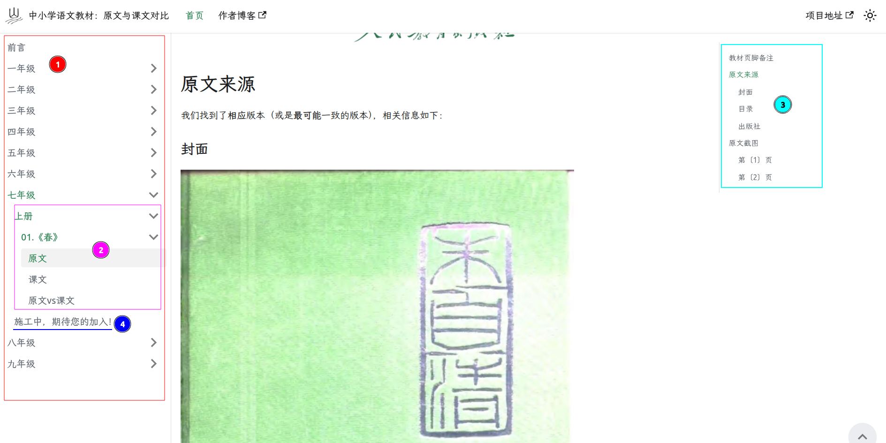
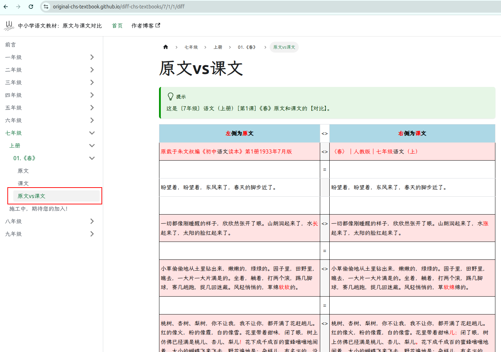
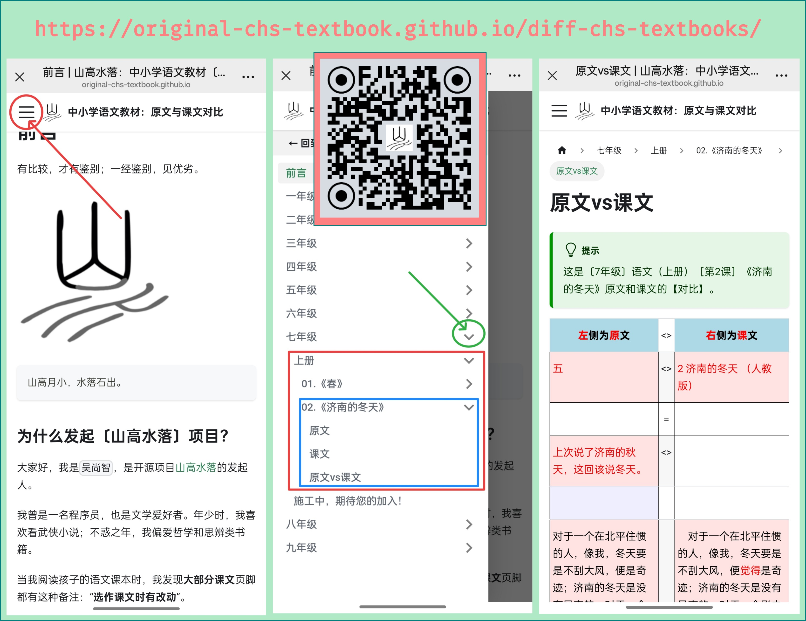

# 山高水落


即使你不会编程，也能为项目做贡献！

找到语文教材中某篇课文的`原文`，将相关照片或截图发送至：

**[邮箱： wuuhvi@outlook.com ](mailto:wuuhvi%40outlook.com?subject=至「山高水落」项目：这是M年级N课的原文相关信息)**


## 项目缘起

『山高水落』项目由自媒体人`吴尚智`发起和命名，旨在找到`中小学语文统编教材`中那些“**选作课文时有改动**”的课文`原文`，并给出原文和课文的`文本对比结果`。

项目名`山高水落`乃受**苏轼**名作《后赤壁赋》中一语句的启发而来，此句颇具禅意，也是项目的`SLOGAN`：

```slogan
山高月小
水落石出
```

我们认为：

```
有比较，才有鉴别
一经鉴别，见优劣
```

## 项目Logo


项目Logo名为`山水`，由项目发起人`吴尚智`设计，并用[Inkscape](https://inkscape.org/)制作完成。作者保留一切权利。

### 设计理念

`山水`Logo采用简约风格和简约配色。将小篆体的“山”“水”二字稍作变形、叠加；取山水画的黑、灰、白三色。一静一动；一阳刚，一阴柔。

此设计通过山水形态，直观对比显现“山高水落”，试图展现`中文汉字之美`；而项目本身目标是为了找出那些被窜改的原文，试图还原优秀篇章的真实面目，尽显`中文文章之美`。Logo设计理念与项目目标相谐。

`山水`Logo为『山高水落』项目的唯一标识，不得用于其他用途。


## 项目依赖

`山高水落`的网页使用[Docusaurus](https://docusaurus.io/)构建；当前所用Docusaurus版本为`v3.8.1`。

网页内嵌的`文本对比结果`，是用[Beyond Compare](https://www.scootersoftware.com/)（v5.1.1）对比工具生成的。


## 获取项目

倘若你想为项目做贡献，且有编程经验（或有GitHub使用经验），最好先`fork`[山高水落](https://github.com/original-chs-textbook/diff-chs-textbooks)项目，并`git clone`到本地。当你新增或改动后，提交到你的GitHub项目，然后申请合并。**GitHub能自动记录你的贡献**。

倘若你只是为了本地试用，又或者，你不便参与项目，但愿意通过邮件等方式提交`原文图片`或`对比结果`，你可用以下方式先行测试，预览效果。

1. 基本工具

推荐使用`nvm`等工具安装npm，推荐使用`yarn`工具来构建项目。

```bash
nvm install --lts

npm install --global yarn
```

2. 获取项目代码


```bash
git clone https://github.com/original-chs-textbook/diff-chs-textbooks
```

3. 项目编译和测试

```bash
cd diff-chs-textbooks

# Installation
yarn

# Local Development
yarn start

# Build
yarn build

```

## 项目结构

通常，你只需要关注`diff-chs-textbooks/docs`目录下的内容。

### docs目录总览

`docs`目录结构如下：

```
diff-chs-textbooks/docs
├── 1
├── 2
├── 3
├── 4
├── 5
├── 6
├── 7
│   └── 1
│       └── assets
├── 8
└── 9

```

`1 ～ 9`各个目录下，分别存放`一年级 ～ 九年级`的相应文件；每个`年级目录`下，用数字`N`作为`目录名`来存放`第N课`的相关文件，上图的展示目录中，`N=1`，表示已经为`七年级`第`1`课创建了目录（1）、子目录（assets）。

### 用脚本自动创建课文目录

下面以`七年级`第`1`课为例，介绍每篇课文相应`目录`的文件组织形式。

我为项目编写了Python3脚本`bc_html2mdx.py`（感谢Gemini Pro 2.5的帮助）。若你是Windows用户，需要先安装Python3。该脚本能自动化创建`指定课文`的目录，并生成相关文件。

在终端执行以下命令，将创建`七年级上册第一课《春》`这篇文章的相关目录和文件：

```bash
# cd diff-chs-textbooks

./utils/bc_html2mdx.py -g 7 -s 1 -n 1 -t "春" -i /path/to/春-BeyondCompare-Report.html 

## 命令行参数说明：
# -g/--grade 指定年级
# -s/--semester 指定上下册（1:上册/2:下册）
# -n/--number 指定第几课
# -t/--title 指定课文标题
# -i/--input 指定HTML格式的对比文件（当前脚本只支持解析由BeyondCompare生成的HTML格式Report）

```

生成的目录结构如下。其中，脚本在`1/assets/`目录下创建的png图片，都是字节为0的空文件，需要在后续进行相应替换。

```
diff-chs-textbooks/docs/7
├── 1
│   ├── assets
│   │   ├── original-cover.png
│   │   ├── original-contents.png
│   │   ├── original-publisher.png
│   │   ├── original-01.png
│   │   ├── original-02.png
│   │   ├── textbook-01.png
│   │   ├── textbook-02.png
│   │   ├── textbook-03.png
│   │   └── textbook-remark.png
│   ├── _category_.json
│   ├── textbook.md
│   ├── original.md
│   └── diff.mdx
```

### 图片文件说明

- `original-cover.png` ： 原文所在书籍的`封面`
- `original-contents.png` ： 原文所在书籍的`目录页`
- `original-publisher.png` ： 原文所在书籍的`出版社与出版日期页`
- `original-01.png` ： 原文`第一页`
- `original-02.png` ： 原文`第二页`
- `textbook-01.png` ： 教材`第一页`
- `textbook-02.png` ： 教材`第二页`
- `textbook-03.png` ： 教材`第三页`
- `textbook-remark.png` ： 教材`注脚`页，通常是`第一页下部`（这张图片会被`original.md`引用）

`textbook-.png`等文件，可以从语文教材PDF中获得。教材PDF可以从GitHub项目 [ChinaTextbook](https://github.com/TapXWorld/ChinaTextbook)下载，也可以去[国家中小学智慧教育平台](https://basic.smartedu.cn/tchMaterial)获取。

项目贡献者的**重要工作之一**是找到`原文`，制作图片，更新`assets`目录。

### MD（Markdown）和MDX（Markdown+JSX）文件说明

- original.md： 对应`原文`网页
- textbook.md： 对应`课文`网页
- diff.mdx： 对应`原文vs课文`网页


通常，参与者不需要更改`diff.mdx`文件，它是用`bc_html2mdx.py`脚本，从`BeyondCompare`生成的HTML格式的报告中，抽取`<table.*?>.*?</table>`标签内容生成的。

另两个文件**可能**需要改动：

- original.md： 当`原文`截图不是`两页`时，需要修改`original.md`，根据实际图片张数，增删`original-？.png`条目；
- textbook.md： 当`课文`截图不是`三页`时，需要修改`textbook.md`，根据实际图片张数，增删`textbook-？.png`条目。


### `七年级`上册第`1`课示例所生成的网页

可以用`bc_html2mdx.py`脚本创建好`1～9`年级所有课文的目录，但并没有这样做，而是完成了一篇原文和课文对比，网站左侧栏才出现相应的入口。

在每个年级的左侧栏中，你会看见`“施工中，期待您的加入！”`的说明，这表明当前年级的工作尚未完成。







## 项目使用原则和免责声明

### 目的与性质

本项目旨在为中小学生、教师以及所有教育工作者提供免费的学习参考资料。我们致力于通过技术手段，帮助大家更好地理解和掌握教科书中的知识。

本项目属于非营利性质，所有内容均仅用于教育、学习和学术研究，不会用于任何商业用途或营利活动。

### 知识产权与合理使用

本项目中使用的部分课文截图、图片或相关内容，其著作权归原作者及出版社所有。

我们严格遵守《[中华人民共和国著作权法](https://www.gov.cn/guoqing/2021-10/29/content_5647633.htm)》规定的 **“合理使用”** 原则。根据该法第二十四条的规定：

> 【第二十四条】　在下列情况下使用作品，可以不经著作权人许可，不向其支付报酬，但应当指明作者姓名或者名称、作品名称，并且不得影响该作品的正常使用，也不得不合理地损害著作权人的合法权益：
>    
>    （一）为个人学习、研究或者欣赏，使用他人已经发表的作品；
>    
>    （二）为介绍、评论某一作品或者说明某一问题，在作品中适当引用他人已经发表的作品；
>    
>     ……
>    
>    （六）为学校课堂教学或者科学研究，翻译、改编、汇编、播放或者少量复制已经发表的作品，供教学或者科研人员使用，但不得出版发行；

本项目正是基于上述条款，为课堂教学、个人学习等目的，对已发表的教科书内容及其相应原文进行适当引用和辅助性展示。我们仅截取与教学评论直接相关的部分，并始终在显著位置标注书名、出版社和页码等信息，以尊重原作者的权益。

### 访问者须知与免责声明

在**使用或引用本项目资源**时，你需要**说明**来自『**山高水落**』项目，并给出**项目URL**（或二维码）。

`山高水落`URL和二维码：

`https://original-chs-textbook.github.io/diff-chs-textbooks/`


本项目鼓励学习和交流，但请注意，任何将本项目内容用于商业目的、或进行二次传播和修改的行为，都可能存在侵犯著作权的风险。

**用户需自行承担其行为所产生的全部法律责任，本项目发起人和开发者不对此承担任何连带责任。**

请在法律和道德规范的框架下使用本项目的资源。