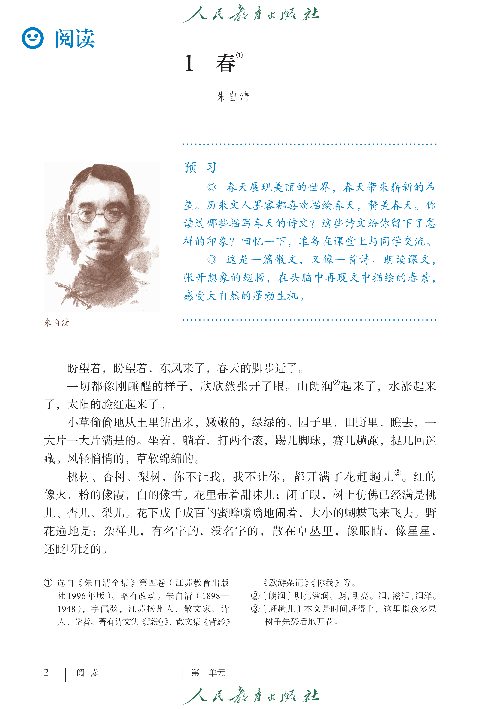
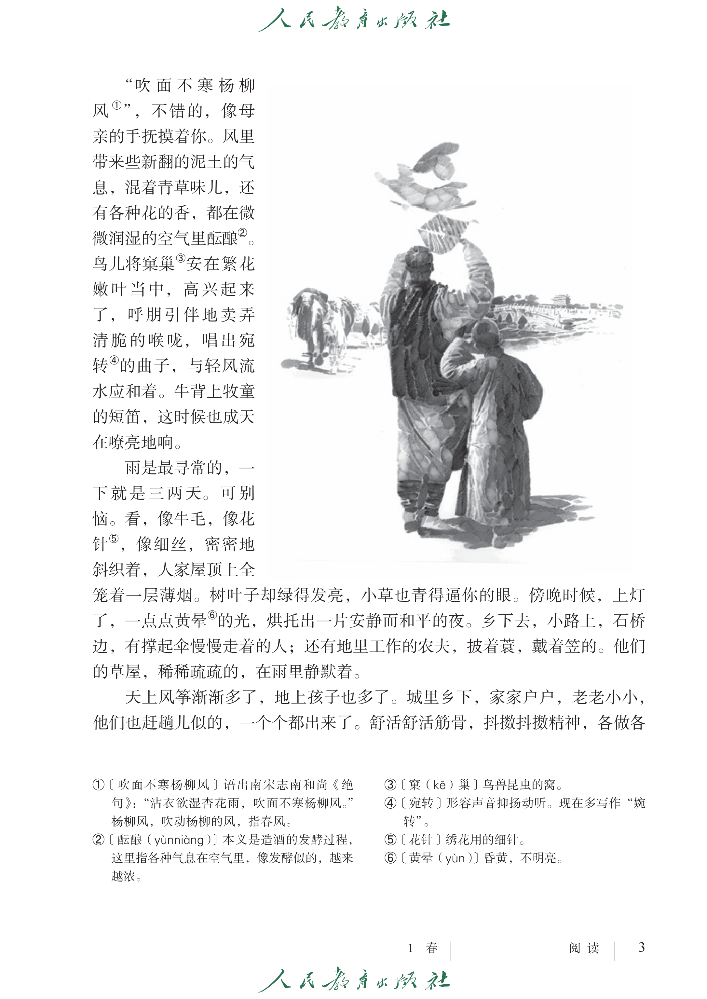
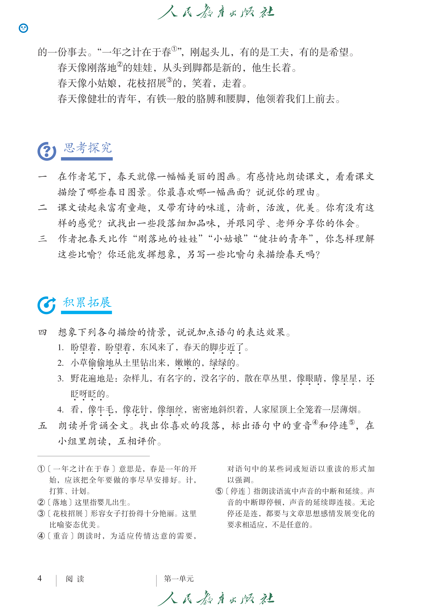

:::tip
这是〔7年级〕语文（上册）［第1课］的【课文】：《春》
:::

:::warning
本项目（`山高水落`）中使用的`原文`和`课文`的截图、图片或文字内容，**其著作权归原作者及出版社所有**。

当你使用这些资源时，意味着你已经阅读《👉[访问者须知与免责声明](/#访问者须知与免责声明)》，并接受其中条款。

再次提醒：你需自行承担*可能的侵犯著作权的风险和全部法律责任*，而**本项目发起人和开发者不承担任何连带责任**。
:::

## 课文

### 第〔1〕页

### 第〔2〕页

### 第〔3〕页

