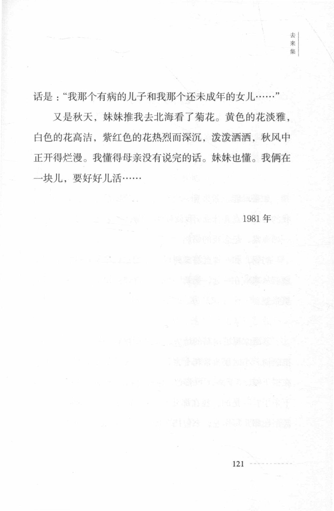

:::tip
这是〔7年级〕语文（上册）［第5课］《秋天的怀念》的【原文】相关信息。
:::

:::warning
本项目（`山高水落`）中使用的`原文`和`课文`的截图、图片或文字内容，**其著作权归原作者及出版社所有**。

当你使用这些资源时，意味着你已经阅读《👉[访问者须知与免责声明](/#访问者须知与免责声明)》，并接受其中条款。

再次提醒：你需自行承担*可能的侵犯著作权的风险和全部法律责任*，而**本项目发起人和开发者不承担任何连带责任**。
:::

## 教材页脚备注

## 原文来源

我们没有找到了`人民文学出版社`**2005年版**，但以下`1997版`和`2019版`都来自同一出版社，二者内容一致。`2005年版`作为一个中间版本，没理由改动。因此，教材所引用的原文，**极可能**与本页所示的原文内容一致。

相关信息如下：

### 1997年版

### 2019年版

## 1997年版原文截图

### 第〔1〕页

### 第〔2〕页

## 2019年版原文截图

### 第〔1〕页

### 第〔2〕页

### 第〔3〕页

