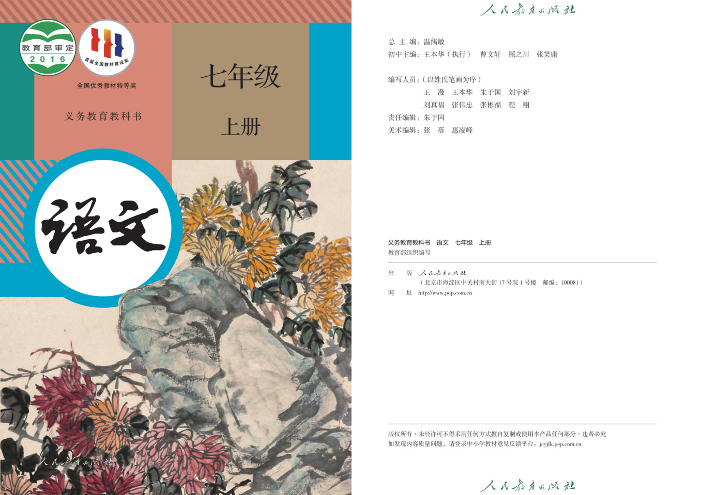
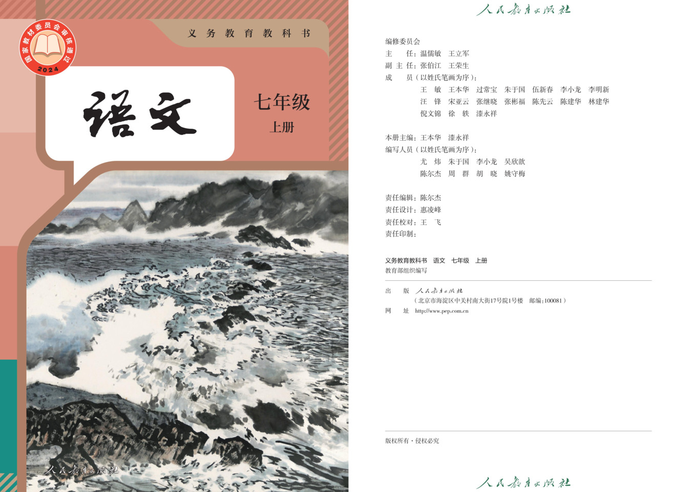
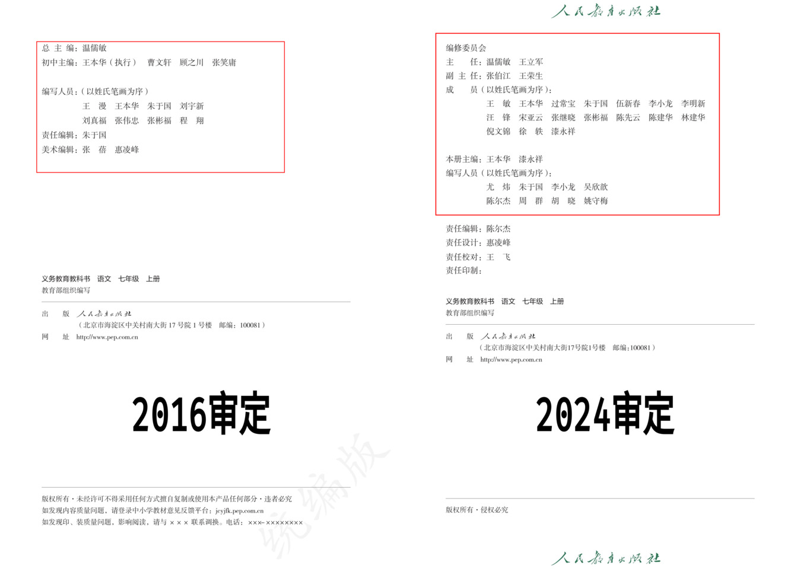
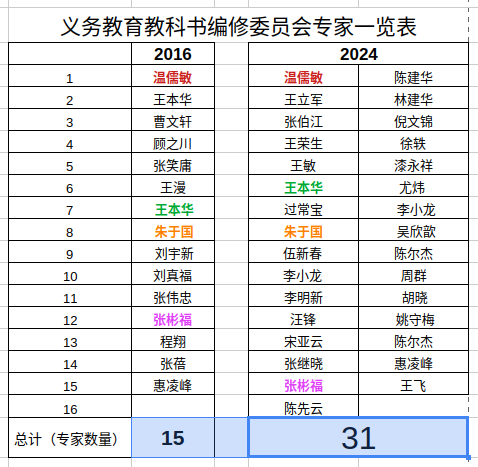

:::tip
这是〔7年级〕语文统编教材（上册）2016与2024教材编修专家组成员对比。
:::

:::warning
本项目（`山高水落`）中使用的`原文`和`课文`的截图、图片或文字内容，**其著作权归原作者及出版社所有**。

当你使用这些资源时，意味着你已经阅读《👉[访问者须知与免责声明](/#访问者须知与免责声明)》，并接受其中条款。

再次提醒：你需自行承担*可能的侵犯著作权的风险和全部法律责任*，而**本项目发起人和开发者不承担任何连带责任**。
:::

## 2016审定教材

## 2024审定教材

## 2016专家组 VS 2024专家组

export const MyComponent = () => (
    

      <table className="fc" cellSpacing="0" cellPadding="0">
          <tr className="AlignCenter">
            <td className="HeaderItem">左侧为2016审定</td>
            <td className="AlignCenter">&lt;&gt;</td>
            <td className="HeaderItem">右侧为2024审定</td>
          </tr>
      <tr className="SectionMiddle">
      <td className="TextItemSame">&nbsp;</td>
      <td className="AlignCenter">&nbsp;</td>
      <td className="TextItemInsigMod">&nbsp;</td>
      </tr>
      <tr className="SectionMiddle">
      <td className="TextItemSame">&nbsp;</td>
      <td className="AlignCenter">&nbsp;</td>
      <td className="TextItemSigMod">编修委员会</td>
      </tr>
      <tr className="SectionMiddle">
      <td className="TextItemSame">&nbsp;</td>
      <td className="AlignCenter">&nbsp;</td>
      <td className="TextItemInsigMod">&nbsp;</td>
      </tr>
      <tr className="SectionEnd">
      <td className="TextItemSigMod">总主编:温儒敏</td>
      <td className="AlignCenter">&nbsp;</td>
      <td className="TextItemSigMod">主任:温儒敏&nbsp; 王立军</td>
      </tr>
      <tr className="SectionAll">
      <td className="TextItemSame">&nbsp;</td>
      <td className="AlignCenter">=</td>
      <td className="TextItemSame">&nbsp;</td>
      </tr>
      <tr className="SectionAll">
      <td className="TextItemSigMod">初中主编:王本华(执行)&nbsp; 曹文轩&nbsp; 顾之川&nbsp; 张笑庸</td>
      <td className="AlignCenter">&lt;&gt;</td>
      <td className="TextItemSigMod">副主任:张伯江&nbsp; 王荣生</td>
      </tr>
      <tr className="SectionAll">
      <td className="TextItemSame">&nbsp;</td>
      <td className="AlignCenter">=</td>
      <td className="TextItemSame">&nbsp;</td>
      </tr>
      <tr className="SectionBegin">
      <td className="TextItemSigMod">编写人员:(以姓氏笔画为序)</td>
      <td className="AlignCenter">&lt;&gt;</td>
      <td className="TextItemSigMod">成员(以姓氏笔画为序):</td>
      </tr>
      <tr className="SectionMiddle">
      <td className="TextItemSame">&nbsp;</td>
      <td className="AlignCenter">&nbsp;</td>
      <td className="TextItemInsigMod">&nbsp;</td>
      </tr>
      <tr className="SectionMiddle">
      <td className="TextItemSigMod">王漫&nbsp; 王本华&nbsp; 朱于国&nbsp; 刘宇新</td>
      <td className="AlignCenter">&nbsp;</td>
      <td className="TextItemSigMod">王敏&nbsp; 王本华&nbsp; 过常宝&nbsp; 朱于国&nbsp; 伍新春&nbsp; 李小龙&nbsp; 李明新</td>
      </tr>
      <tr className="SectionMiddle">
      <td className="TextItemSigMod">刘真福&nbsp; 张伟忠&nbsp; 张彬福&nbsp; 程翔</td>
      <td className="AlignCenter">&nbsp;</td>
      <td className="TextItemSigMod">汪锋&nbsp; 宋亚云&nbsp; 张继晓&nbsp; 张彬福&nbsp; 陈先云&nbsp; 陈建华&nbsp; 林建华</td>
      </tr>
      <tr className="SectionEnd">
      <td className="TextItemSame">&nbsp;</td>
      <td className="AlignCenter">&nbsp;</td>
      <td className="TextItemSigMod">倪文锦&nbsp; 徐轶&nbsp; 漆永祥</td>
      </tr>
      <tr className="SectionAll">
      <td className="TextItemSame">&nbsp;</td>
      <td className="AlignCenter">=</td>
      <td className="TextItemSame">&nbsp;</td>
      </tr>
      <tr className="SectionBegin">
      <td className="TextItemSame">&nbsp;</td>
      <td className="AlignCenter">&lt;&gt;</td>
      <td className="TextItemSigMod">本册主编: 王本华 漆永祥</td>
      </tr>
      <tr className="SectionMiddle">
      <td className="TextItemSame">&nbsp;</td>
      <td className="AlignCenter">&nbsp;</td>
      <td className="TextItemInsigMod">&nbsp;</td>
      </tr>
      <tr className="SectionMiddle">
      <td className="TextItemSame">&nbsp;</td>
      <td className="AlignCenter">&nbsp;</td>
      <td className="TextItemSigMod">编写人员(以姓氏笔画为序):</td>
      </tr>
      <tr className="SectionMiddle">
      <td className="TextItemSame">&nbsp;</td>
      <td className="AlignCenter">&nbsp;</td>
      <td className="TextItemSigMod">尤炜&nbsp; 朱于国&nbsp; 李小龙&nbsp; 吴欣歆</td>
      </tr>
      <tr className="SectionMiddle">
      <td className="TextItemSame">&nbsp;</td>
      <td className="AlignCenter">&nbsp;</td>
      <td className="TextItemSigMod">陈尔杰 周群&nbsp; 胡晓&nbsp; 姚守梅</td>
      </tr>
      <tr className="SectionMiddle">
      <td className="TextItemSame">&nbsp;</td>
      <td className="AlignCenter">&nbsp;</td>
      <td className="TextItemInsigMod">&nbsp;</td>
      </tr>
      <tr className="SectionMiddle">
      <td className="TextItemSigMod">责任编辑:朱于国</td>
      <td className="AlignCenter">&nbsp;</td>
      <td className="TextItemSigMod">责任编辑:陈尔杰</td>
      </tr>
      <tr className="SectionMiddle">
      <td className="TextItemSame">&nbsp;</td>
      <td className="AlignCenter">&nbsp;</td>
      <td className="TextItemInsigMod">&nbsp;</td>
      </tr>
      <tr className="SectionMiddle">
      <td className="TextItemInsigMod">&nbsp;</td>
      <td className="AlignCenter">&nbsp;</td>
      <td className="TextItemSame">&nbsp;</td>
      </tr>
      <tr className="SectionMiddle">
      <td className="TextItemSigMod">美术编辑:张蓓 惠凌峰</td>
      <td className="AlignCenter">&nbsp;</td>
      <td className="TextItemSigMod">责任设计:惠凌峰</td>
      </tr>
      <tr className="SectionMiddle">
      <td className="TextItemSame">&nbsp;</td>
      <td className="AlignCenter">&nbsp;</td>
      <td className="TextItemInsigMod">&nbsp;</td>
      </tr>
      <tr className="SectionEnd">
      <td className="TextItemSame">&nbsp;</td>
      <td className="AlignCenter">&nbsp;</td>
      <td className="TextItemSigMod">责任校对:王飞</td>
      </tr>
      </table>
    

);

<MyComponent />
